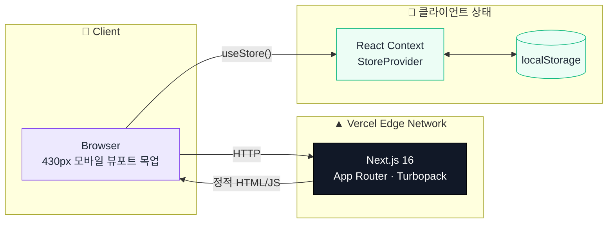
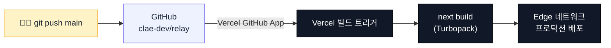
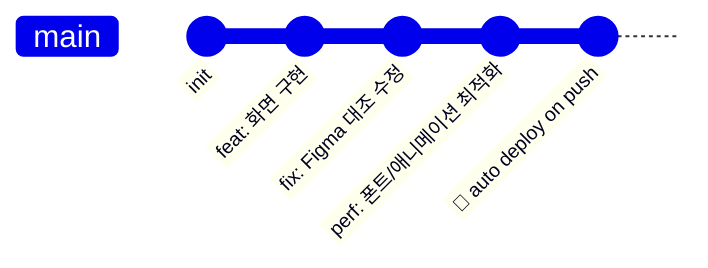

<div align="center">

# 🔁 RE:LAY

### _정기배송이 아니라, 예약형 리필_

브랜드가 주기를 정하는 **Push형 정기배송** 대신, 소비자가 소진 시점을 직접 호출하는
**예약형 구독(Pull)** 과 **합배송**으로 배송비·포장재·탄소를 줄이는 컨셉을 검증하는 클릭 프로토타입

<br/>

[](https://relay-plum-eta.vercel.app)
[](#)
[](#)
[](#)
[](#)
[](#)

<br/>

[📱 기능](#-주요-기능) ·
[🏗️ 아키텍처](#️-아키텍처) ·
[🛠️ 기술스택](#️-기술-스택) ·
[🚀 배포](#-자동-배포-파이프라인) ·
[🧠 상태 관리](#-상태-관리--주요-액션) ·
[⚡ 실행](#-로컬-실행)

</div>

---

## 📱 주요 기능

<table>
<tr>
<td width="50%" valign="top">

### 🛍️ 상품 상세
쿠션·리필 상품 정보 + **RE:LAY 체험 혜택** 안내.
바텀시트에서 "본품만 구매" / "본품 + 리필 구독 예약" 선택.

</td>
<td width="50%" valign="top">

### 💳 결제 · 주문완료
배송지 · 결제수단 · 결제금액 확인 후 결제.
구독 여부에 따라 **주문완료(구독)** / **체험권 안내** 두 화면으로 분기.

</td>
</tr>
<tr>
<td valign="top">

### 📦 리필 관리
사용 중 구독의 진행률 · 다음 알림일 표시.
알림일 변경 · 회차 건너뛰기 · 혜택 종료, **체험권** 별도 섹션에서 신청.

</td>
<td valign="top">

### ✅ 사용 여부 확인 → 리필 결제
"많이 남음 / 거의 다 씀 / 사용 중단" 선택 → 거의 다 썼으면 리필 결제로 이동.
**합배송** 화면에서 다른 구독과 한 상자로 묶어 포인트 적립.

</td>
</tr>
</table>

> 실 서비스 API·결제 연동은 없는 목업이며, 모든 데이터는 브라우저 `localStorage`에만 저장됩니다.

---

## 🏗️ 아키텍처



- **백엔드·DB 없음** — 상품 목록은 `src/lib/data.ts`의 정적 in-memory 데이터, 주문/구독 상태는 전부 클라이언트에서 생성
- **상태 관리**: 단일 `React Context`(`StoreProvider`) + `useMemo`로 감싼 값 객체. 마운트 후 `localStorage`에서 1회 하이드레이션(서버·클라이언트 첫 렌더 불일치 방지), 이후 상태 변경마다 자동 저장
- **라우팅**: 9개 화면 모두 `"use client"` (홈만 서버 컴포넌트) — `usePathname()` 기반 페이지 전환 페이드 애니메이션(`framer-motion` `LazyMotion`)

---

## 🛠️ 기술 스택

<p>


</p>

| 영역 | 라이브러리 / 설정 |
|---|---|
| **프레임워크** | Next.js 16.2.12 (App Router, Turbopack 빌드) |
| **UI** | React 19.2.4 + TypeScript 5 |
| **스타일** | Tailwind CSS v4 (`@theme inline` 디자인 토큰: `--color-ink`, `--radius-card` 등) |
| **애니메이션** | `framer-motion` — `LazyMotion` + `domAnimation`(경량 `m` 컴포넌트)으로 페이지 전환 페이드 · 바텀시트 스프링 |
| **폰트** | Pretendard Variable, `next/font/local`로 자체 호스팅(외부 CDN 요청 제거) |
| **이미지** | `next/image` — 히어로는 `quality=95` + `priority`, 썸네일은 `quality=70` |
| **상태** | React Context (`StoreProvider`) + `localStorage` 영속화, 서버 API 없음 |
| **배포** | Vercel (GitHub 저장소 연결, `main` 푸시 시 자동 배포) |

---

## 🚀 자동 배포 파이프라인



- 별도 CI 워크플로(GitHub Actions) 없이 **Vercel의 Git 연동**만으로 빌드·배포가 자동 실행됩니다
- 백엔드 서버가 없어 EC2 등 별도 인프라, `.env`, 시크릿 설정이 필요 없습니다

---

## 🧠 상태 관리 · 주요 액션

`src/lib/store.tsx`의 `useStore()` 훅이 노출하는 액션들입니다. (백엔드가 없어 API 엔드포인트 대신 클라이언트 상태 액션이 그 역할을 합니다.)

| 액션 | 설명 |
|---|---|
| `setDraftPurchase(productId, withSubscription)` | 상품 상세 → 결제 진입 시 구매 초안 저장 |
| `completePurchase()` | 결제 완료 → 주문 생성 + (구독 시) `RefillSubscription` 생성 |
| `claimVoucher(id)` | 체험권 상태 구독을 정식 구독(`in_progress`)으로 전환 |
| `setUsageCheck(id, status)` | 사용 여부 확인 결과 저장 (`plenty` / `almost_done` / `stopped`) |
| `startRefillCheckout(primaryId)` / `toggleCombinePartner` / `setCombineMode` | 리필 결제 초안 생성 및 합배송 대상 선택 |
| `completeRefillCheckout()` | 리필 결제 완료 → 해당 구독들을 `pending_shipment`로 전환 |
| `changeNotifyDate(id, date)` / `skipCycle(id)` | 알림일 변경 / 이번 회차 건너뛰기 |
| `endSubscription(id)` / `continueSubscription(id)` | 혜택 종료 / 종료된 혜택 다시 시작 |
| `eligibleCombinePartners(id)` | 합배송 가능한 다른 구독 목록 조회 |

> 응답 래퍼나 네트워크 지연 없이 모두 동기 `setState` — 실제 백엔드 붙일 때 이 액션 시그니처를 그대로 API 계약으로 옮기면 됩니다.

---

## 📁 프로젝트 구조

<details open>
<summary><b>🌳 전체 트리</b></summary>

```
RELAY/
│
├── 📦 public/
│   ├── icons/sparkle.png                   사은품 안내 스파클 아이콘
│   └── products/                           상품 사진 (헤라 쿠션 · 리보에이치 리필)
│
├── ⚙️ next.config.ts                       next/image 허용 quality 설정
│
└── 📱 src/
    ├── app/
    │   ├── layout.tsx                      StoreProvider + PageTransition + 폰트
    │   ├── globals.css                     Tailwind v4 + 디자인 토큰
    │   ├── fonts/PretendardVariable.woff2   자체 호스팅 폰트
    │   ├── page.tsx                         🏠 홈 (서버 컴포넌트)
    │   ├── product/[slug]/                  🛍️ 상품 상세 + 구독 신청 바텀시트
    │   ├── checkout/                        💳 결제하기
    │   ├── order/complete/                  ✅ 주문완료 (구독 / 체험권 분기)
    │   ├── my/refills/                      📦 리필 관리 (진행중 · 체험권 · 종료)
    │   │   └── [id]/check/                  🔍 사용 여부 확인
    │   └── refill-checkout/[id]/
    │       ├── page.tsx                     리필 결제
    │       ├── combine/                     합배송 선택
    │       └── complete/                    리필 결제 완료
    │
    ├── components/
    │   ├── TopBar.tsx · Button.tsx · icons.tsx
    │   ├── ProductThumb.tsx                 공용 상품 썸네일 (톤별 이미지)
    │   ├── RadioOption.tsx · ProgressBar.tsx
    │   ├── BottomSheet.tsx                  framer-motion 바텀시트
    │   └── PageTransition.tsx               페이지 전환 페이드
    │
    └── lib/
        ├── types.ts                         Product · RefillSubscription 등 타입
        ├── data.ts                          정적 상품 데이터 + 시드 구독
        └── store.tsx                        React Context 상태 + localStorage 영속화
```

</details>

---

## ⚡ 로컬 실행

```bash
npm install
npm run dev
```

| | URL |
|---|---|
| 로컬 서버 | `http://localhost:3000` (포트 사용 중이면 자동으로 다음 포트) |

별도 `.env`나 백엔드 기동 없이 바로 확인할 수 있습니다.

```bash
npm run build   # 프로덕션 빌드
npm run start   # 빌드 결과 실행
npm run lint    # ESLint
```

---

## 🌱 환경변수

이 프로젝트는 **환경변수가 필요 없습니다.** 백엔드·DB·외부 API 키 없이 정적 데이터만으로 동작합니다.

이미지 품질 등 next/image 관련 설정만 `next.config.ts`에서 관리합니다.

```ts
// next.config.ts
images: {
  qualities: [70, 95], // 썸네일 70 / 히어로 95
}
```

---

## 🌿 브랜치 · 커밋 규칙

이 프로젝트는 **`main` 단일 브랜치**로 운영되며, 커밋·푸시 즉시 Vercel 프로덕션에 반영됩니다.



| 규칙 | 내용 |
|---|---|
| 커밋 메시지 | 한국어로 작성, 변경 이유(왜) 중심 |
| 배포 | `main` 푸시 = 즉시 프로덕션 배포 (별도 스테이징 없음) |

---

## ✍️ 코딩 컨벤션

### 🔤 네이밍

| 케이스 | 용도 | 예 |
|---|---|---|
| `camelCase` | 변수 · 함수 · 훅 | `withSubscription` · `handlePay()` |
| `PascalCase` | 컴포넌트 · 타입 | `ProductThumb` · `RefillSubscription` |
| `UPPER_SNAKE_CASE` | 상수 맵 | `PRODUCTS` · `TONE_STYLES` |

### 🎨 스타일

- Tailwind 유틸리티 우선, 디자인 토큰은 `globals.css`의 `@theme inline`에서 관리 (`--color-ink`, `--color-accent`, `--radius-card` 등)
- 임의값(`text-[13.5px]` 등)은 Figma 실측 값을 그대로 반영한 것 — 임의로 반올림하지 않음
- 컴포넌트 재사용: 상품 이미지는 톤(`cushion` / `scalp`) 기준으로 `ProductThumb` 하나만 사용

### 💬 주석

필요할 때만, **왜(why)** 를 남깁니다 — 코드가 이미 보여주는 **무엇을(what)** 은 반복하지 않습니다.

```tsx
// 하이드레이션 이펙트가 페이지 레벨 effect보다 늦게 실행되어
// 방금 초기화한 draft를 덮어쓰는 레이스를 막기 위함
draftRefillCheckout: prev.draftRefillCheckout ?? parsed.draftRefillCheckout ?? null,
```

---

## ⚠️ 주의사항

> 이 프로젝트는 `main` 푸시가 즉시 프로덕션 배포를 트리거합니다.

| 🚨 | 내용 |
|---|---|
| 🚀 | `main` 직접 푸시 → 즉시 배포. 별도 스테이징 환경 없음 |
| 🧪 | 결제·배송·회원 정보는 전부 목업이며 실제 트랜잭션이 발생하지 않음 |
| 💾 | 모든 상태는 브라우저 `localStorage` 기준 — 기기·브라우저를 바꾸면 데이터가 보이지 않음 |

---

<div align="center">

### 🔁 RE:LAY

_예약은 내가, 가격은 미리 — Made with Next.js ▲_

</div>
